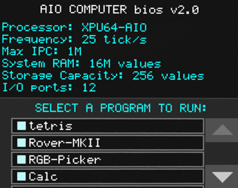

  

|Component|`Computer`|
|---|---|
|**Module**|`ARCHEAN_computer`|
|**Mass**|10 kg|
|[**Size**](# "Based on the component's occupancy in a fixed 25cm grid.")|100 x 100 x 50 cm|
#
---
> To learn how to use the computer's programming interface, visit the XenonCode IDE page.

# Description

The computer is a component designed to run XenonCode programs to control other components or display various information on its screen.

It has characteristics that determine its power, storage, and memory.
These information are visible on the BIOS as shown in the image below.

### BIOS Information:
- **Processor Type**: The XPU64-AIO processor refers to this All-In-One computer component type.
- **Frequency**: The frequency is the speed at which the computer executes the code of the current program and will match the server's `updates_per_second` setting (25 ticks per second by default).
- **Max IPC**: This parameter is determined by a configuration file and is the maximum number of instructions per cycle before it "crashes" virtually.
- **System RAM**: In XenonCode programs, you can store values in volatile variables that reset when the computer restarts or when a program is reloaded. This parameter represents the maximum number of values for all variables of the currently running program.
- **Storage Capacity**: Similar to system RAM, there is a storage variable type that stores data on the hard drive permanently until modified. In this case, it is limited to a maximum of 256 values.
- **I/O Ports**: This parameter is determined by the components and simply indicates the number of data ports on the computer.

> The BIOS is a program that is running by default on every computer when it boots.
>
> In this case, its role is to indicate the characteristics of the computer as well as the list of programs available on the hard drive so that you can select one to execute.
>
> It is possible to customize the BIOS by creating a new file named "main.xc" to modify its appearance or automatically load a program. Please refer to the XenonCode IDE documentation for more information.

# Usage
### Program:
When a program is created and saved, it will appear in the list of programs on the BIOS. You can select the program to execute using the `F` key.
### Button:
The computer has two physical buttons, the "Code" button that opens the XenonCode IDE for developing your programs, and a "Reboot" button that restarts the computer and re-executes the main.xc program (BIOS).
### Power:
To operate, the computer requires a low-voltage power supply. It consumes 30 watts when idle and its consumption can rise up to 500 watts depending on the ratio between the number of instructions executed by the currently running program and the current MAX IPC configured on the server.
### HDD:
The Computer has a hard drive bay. You can have multiple HDD in the bay (only one active at a time), swap HDD with other computers or stash them in your inventory. This is useful when you want to move your computer somewhere else without losing your code.

---
>- The resolution of the integrated screen is 200x160 pixels.
>- *The contents of HDDs (your code) is not lost if you destroy a Computer component by mistake. It will still exist in the server's files (or your own computer if you're playing solo). You can find it in (Server Settings)/worlds/(World Name)/ARCHEAN_computer/HDD-... You may even edit the code from there and it will reboot your computer live in the game, if you prefer using an external editor (VSCode actually has a XenonCode extension available)*
