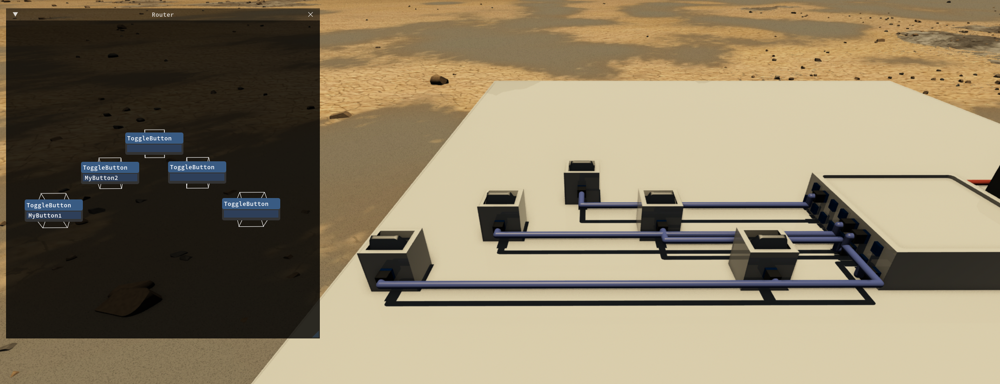
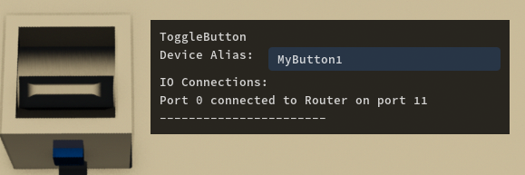

  

|Component|`Router`|
|---|---|
|**Module**|`ARCHEAN_computer`|
|**Mass**|20 kg|
|[**Size**](# "Based on the component's occupancy in a fixed 25cm grid.")|100 x 100 x 25 cm|
#
---

# Description
A router is a device used to connect different components to a network. Its main advantage is the ability to connect a practically unlimited number of components, all controllable by one or more computers on the network. In contrast, an individual computer's ability to connect to components is limited by its number of available ports.

Each router is equipped with 30 data ports. They can be chained to increase the total number of available ports, thus multiplying the ports by the number of routers connected together.

It requires a low-voltage power supply to operate and consumes 50 watts.

# Usage
When the router is powered on and connected to components, it allows assigning aliases to components via a three-dimensional visual interface, which can later be used to identify these components from computer code.

You can open the router interface using the `F` key.

The interface appears as a 3D environment (see the image below) in which you can navigate while holding right-click, using the standard movement keys `WASD`, `CONTROL/SPACE` to go Down/Up, and `Shift` to accelerate movement.

The components are positioned at their actual 3D position relative to each other in the build, and will include all connected components from all routers in the chain.

Each component displays a label where you can enter the alias that will be used later on a computer. To learn how to use aliases, refer to the XenonCode IDE page.

It is possible to assign an alias to a component directly by displaying its information window using the `V` key, as shown in the example below.

# Controlling multiple components with a single alias
In certain situations, it can be practical to control multiple components serving the same purpose with a single alias. To do this, simply add an asterisk `*` at the end of the alias in nodes/Xenoncode. For example, if you are building an airplane and have four ailerons on the left wing, you can name them as follows:
- `leftAileron1`
- `leftAileron2`
- `leftAileron3`
- `leftAileron4`

You can then control them using the alias `leftAileron*`. The asterisk `*` allows you to select all components whose alias begins with `leftAileron`.
