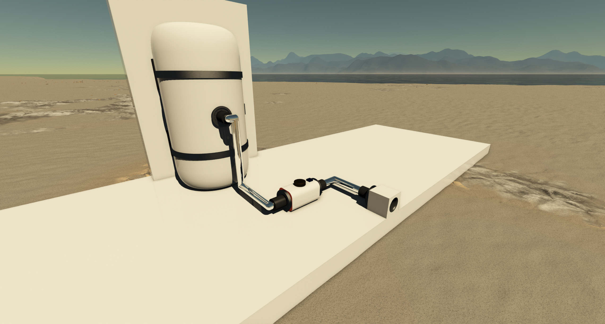

  

|Component|`FluidPort`|
|---|---|
|**Module**|`ARCHEAN_chemical`|
|**Mass**|1 kg|
|[**Size**](# "Based on the component's occupancy in a fixed 25cm grid.")|25 x 25 x 25 cm|
|**Push/Pull Fluid**|Accept Push/Pull|
#
---

# Description
The fluid port is a device that allows for the suction or ejection of fluids.

When pulling in fluid, it will draw in the composition of the surrounding environment. For example, if it is submerged in water, it can fill a fluid tank with H2O, and if it is in the open air, it will draw in the composition of the atmosphere.

When pushing out fluid, it can purge fluid tanks of their contents.

# Usage
The fluid port acts as a bridge between a fluid container and the composition of the surrounding environment.

To operate, it needs to be connected to any component capable of holding or processing fluids.

Below is an example illustrating how it could be connected.

